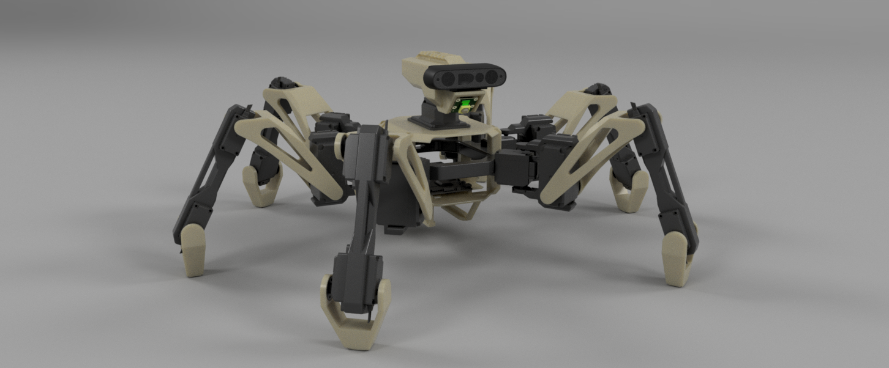
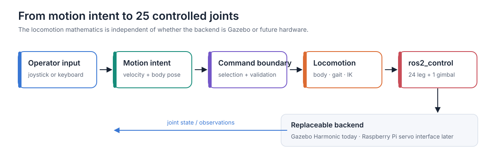
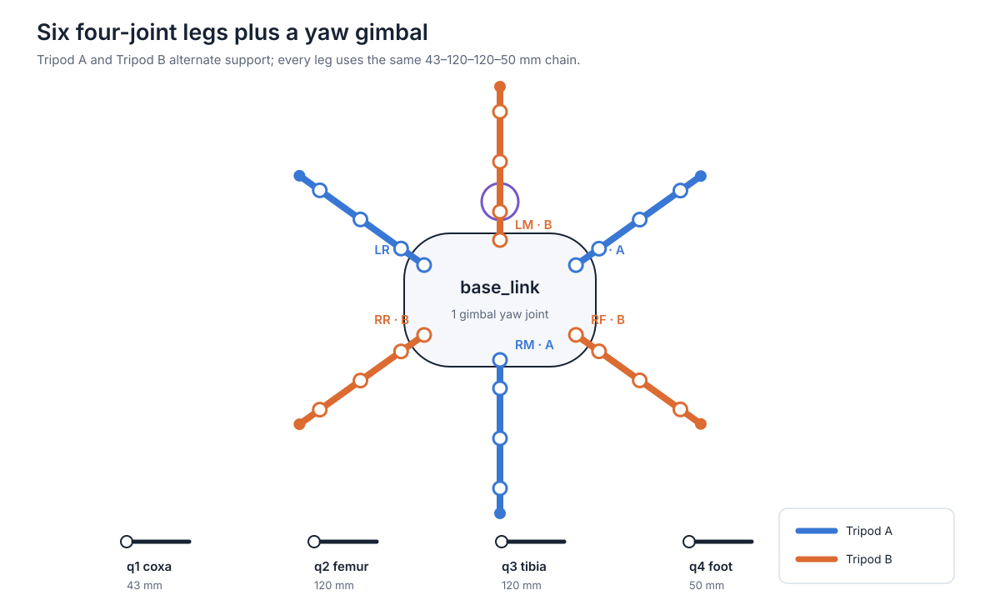
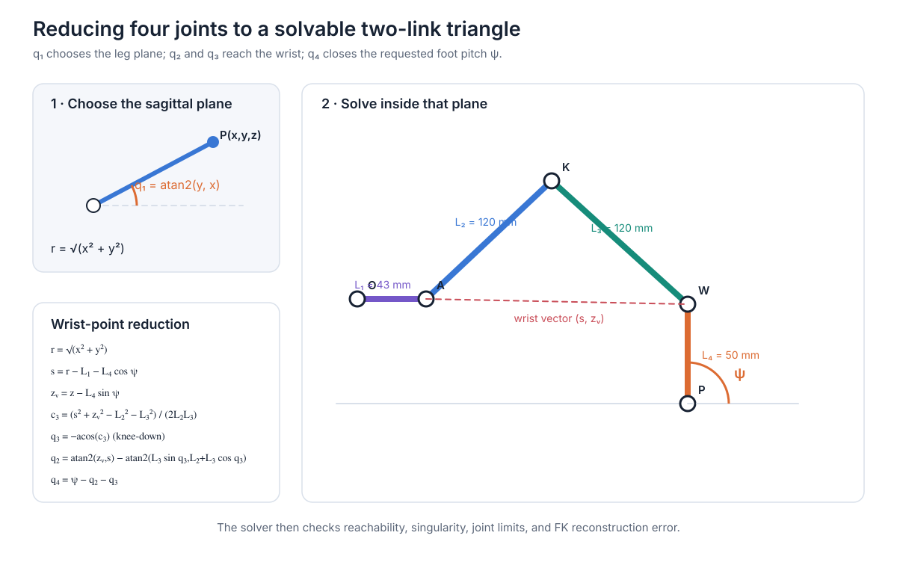
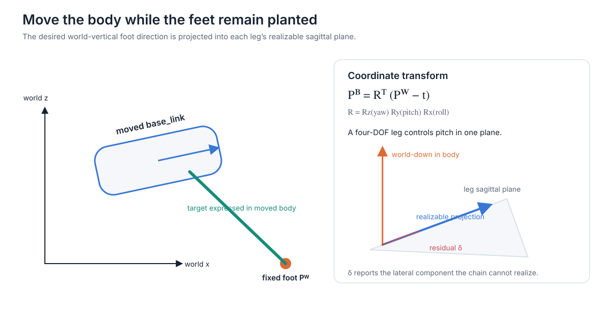
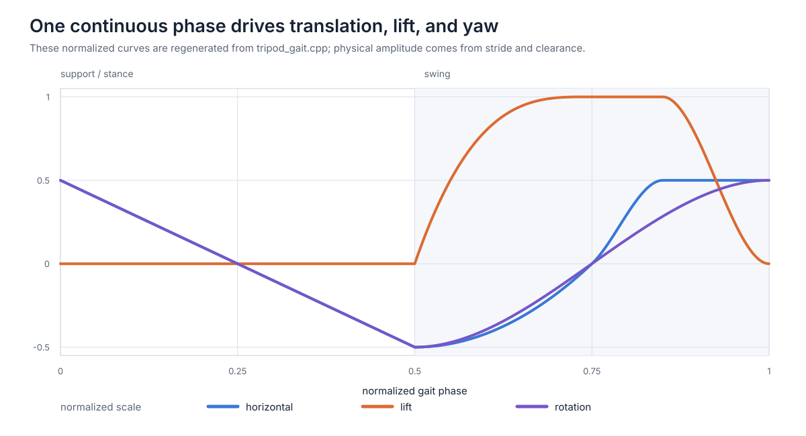
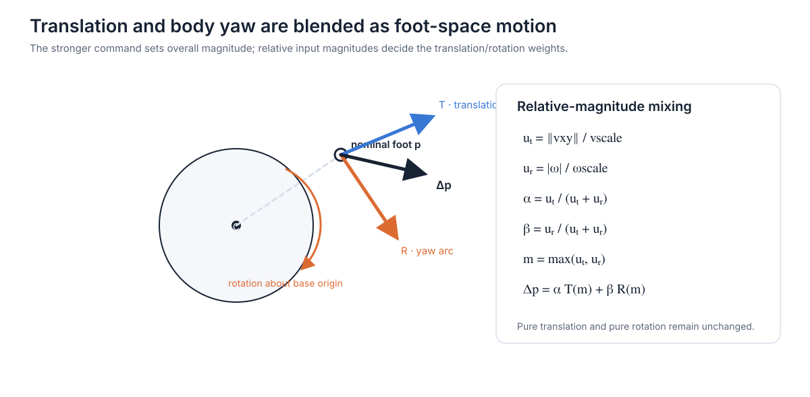
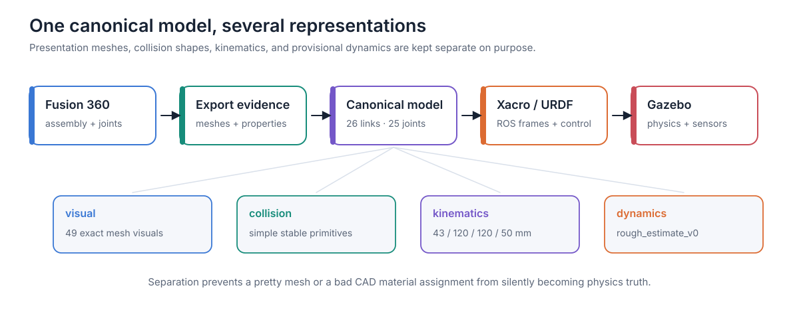
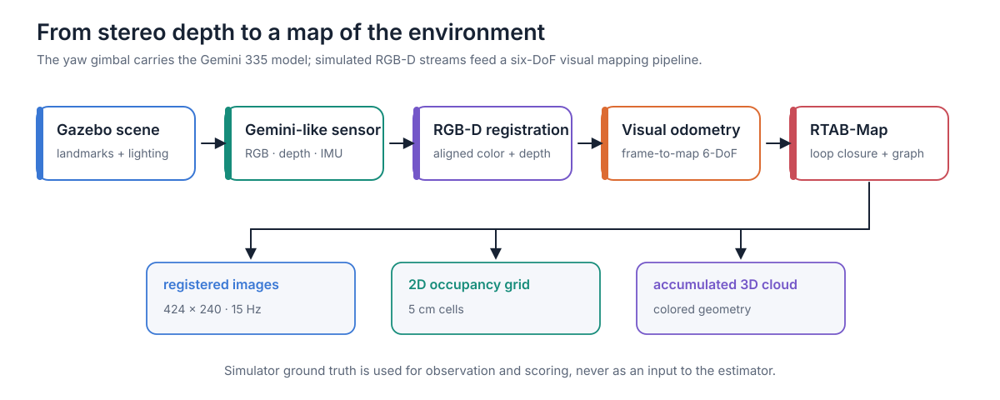

# Araco: a four-DOF hexapod built from first principles




(This readme is ai slop) Araco is my research platform for studying how the geometry, locomotion, simulation, and perception of a many-legged robot fit together. It has six independently controlled legs, four rotary joints per leg, and a yaw joint for its RGB-D camera: **25 controlled joints in total**.

I began the wider Araco project in 2022 and this repository contains its third generation: a ground-up ROS 2 implementation built around a detailed digital twin. My aim was not only to make a robot walk, but to understand and document the complete chain that makes walking possible—from a desired body velocity, through gait phase and analytic inverse kinematics, to joint trajectories and simulated motion. The same model also carries an RGB-D/IMU sensor stack for visual odometry, mapping, and future autonomous navigation work.

This document is both a project tour and a technical write-up. It starts with the physical design, then develops the mathematics and software one layer at a time. Equations are paired with intuition so that the README remains useful to robotics developers, students, makers, and anyone assessing the project as research.

https://github.com/user-attachments/assets/426f452e-7470-4307-b021-07683b961a9c

## Contents

- [What I built](#what-i-built)
- [The physical robot](#the-physical-robot)
- [How the software is organised](#how-the-software-is-organised)
- [Robot geometry and coordinate conventions](#robot-geometry-and-coordinate-conventions)
- [Four-degree-of-freedom leg kinematics](#four-degree-of-freedom-leg-kinematics)
- [Moving the body over planted feet](#moving-the-body-over-planted-feet)
- [Generating a tripod gait](#generating-a-tripod-gait)
- [Blending translation and rotation](#blending-translation-and-rotation)
- [Turning CAD into a digital twin](#turning-cad-into-a-digital-twin)
- [RGB-D perception and mapping](#rgb-d-perception-and-mapping)
- [What the project taught me](#what-the-project-taught-me)
- [Repository map](#repository-map)

## What I built

Araco combines several related pieces of work:

- a physical 3D-printed hexapod with 24 leg servos and a one-axis camera gimbal;
- a canonical 26-link, 25-joint robot model derived from the real CAD assembly;
- closed-form forward and inverse kinematics for a four-joint leg;
- planted-foot body translation and attitude control;
- a responsive tripod gait with time-based phase, variable cadence, lift trajectories, lateral travel, turning, and combined motion;
- a ROS 2 architecture that separates input, locomotion, robot control, simulation, and perception;
- a Gazebo Harmonic digital twin controlled through `ros2_control`; and
- a simulated Gemini-style RGB-D/IMU pipeline connected to visual odometry and RTAB-Map.

The most important design choice is separation of concerns. Locomotion produces a complete 24-joint leg command from a compact motion request. It does not need to know whether those joints belong to Gazebo or physical servos. That boundary lets me improve the gait and kinematics against a repeatable simulator before attaching a hardware-specific output layer.



## The physical robot

The platform is deliberately ambitious for a personal robot: each leg has four active axes rather than the more usual three. The fourth joint controls the foot link independently of the two main pitch joints. That increases servo count and mechanical complexity, but it also lets the controller specify both a foot position and a foot pitch. A three-DOF leg can place a point in space; Araco's fourth axis lets it place an oriented foot in space.

| Subsystem | Hardware | Role |
|---|---|---|
| Main computer | Raspberry Pi 5B, 4 GB | Onboard ROS 2 computer |
| Leg actuators | 19 × DS3235 and 6 × DS5160 servos | 24 leg joints plus camera-gimbal yaw |
| Servo interface | Hiwonder 32-channel controller, strongly identified as an LSC-32 | Generates the servo commands for the physical mechanism |
| Primary perception | Orbbec Gemini 335 | RGB-D sensing and onboard IMU |
| Secondary camera | Raspberry Pi Camera Module 3 | Additional visual sensing |
| Power-management board | PiSugar 3 Plus | Raspberry Pi power management |
| Actuator supply | 7.4 V, 7200 mAh battery | Separate high-current servo supply |

There are six leg positions—left/right, front/middle/rear—and four ordered joints per leg:

1. **coxa yaw, `q₁`**: rotates the whole leg horizontally;
2. **femur pitch, `q₂`**: raises or lowers the upper leg;
3. **tibia pitch, `q₃`**: bends the knee; and
4. **foot pitch, `q₄`**: sets the terminal link orientation.

The nominal link lengths are 43 mm, 120 mm, 120 mm, and 50 mm. The camera adds one gimbal-yaw joint above the body. The resulting model has 26 links: one base, 24 leg links, and one gimbal link.



The two servo types reflect load rather than symmetry. The six femur joints carry the largest sustained moment, so they use the heavier DS5160 units; the remaining leg axes and gimbal use DS3235 units. This distinction also matters in simulation because the mass distribution of a walking robot affects body oscillation and ground contact, even when the kinematic geometry is unchanged.

The product pages and manuals I used to cross-check the documented hardware are the official [Raspberry Pi 5 specification](https://www.raspberrypi.com/products/raspberry-pi-5/), [Hiwonder LSC-32 manual](https://docs.hiwonder.com/projects/32-Channel-Servo-Controller/en/latest/docs/1_User_Manual_checked.html), and [Orbbec Gemini 335 specification](https://store.orbbec.com/products/gemini-335).

## How the software is organised

Araco targets Ubuntu 24.04, ROS 2 Jazzy, and Gazebo Harmonic—the supported ROS/Gazebo pairing documented by the [ROS 2 Jazzy](https://docs.ros.org/en/jazzy/Installation/Alternatives/Ubuntu-Install-Binary.html) and [Gazebo Harmonic](https://gazebosim.org/docs/harmonic/install/) projects.

The codebase is split into eleven ROS packages so that mathematical logic, robot resources, simulator integration, and application wiring have explicit owners.

| Package | Responsibility |
|---|---|
| `araco_interfaces` | Project-specific messages and actions |
| `araco_description` | Canonical geometry, joint ordering, meshes, URDF/Xacro, and RViz resources |
| `araco_kinematics` | Pure four-DOF leg forward and inverse kinematics |
| `araco_locomotion` | Standing, body-pose transforms, gait phase, foot trajectories, IK coordination, and joint commands |
| `araco_supervision` | Central command boundary and robot-state coordination |
| `araco_teleop` | Keyboard and joystick input adapters |
| `araco_gazebo` | Gazebo worlds, plugins, and simulator-specific integration |
| `araco_perception` | Simulated RGB-D/IMU configuration and RViz presentation |
| `araco_navigation` | Visual odometry, RTAB-Map, and mapping configuration |
| `araco_bringup` | Selects a complete runtime profile and starts it in dependency order |
| `araco_system_tests` | System-level behavioural and simulator checks |

A typical walking command moves through the system as follows:

1. Keyboard or joystick input becomes a body-velocity and posture request.
2. The central command boundary selects and validates the active request.
3. Locomotion advances the gait phase, calculates six target foot poses, and solves all six legs.
4. A complete 24-joint candidate is sent to a trajectory controller.
5. `ros2_control` owns the 24 leg joints and the separate gimbal controller owns joint 25.
6. In simulation, `gz_ros2_control` applies those commands to the Gazebo model and returns joint state.

This is more than package tidiness: it keeps the numerical algorithms testable without a running simulator. The kinematics library has no ROS dependency, and the gait components operate on explicit inputs such as phase, velocity, geometry, and elapsed time. ROS nodes form the outer orchestration layer rather than being embedded inside the mathematics.

## Robot geometry and coordinate conventions

Every later equation depends on agreeing what the axes mean. Araco follows the usual ROS body convention:

- `+x` points forward;
- `+y` points left;
- `+z` points upward;
- positive roll is rotation about `x`;
- positive pitch is rotation about `y`; and
- positive yaw is rotation about `z`.

Each leg is mounted at a known position and yaw angle on the body. Its local coxa frame uses the same right-handed convention, but its radial direction points outward from the mounting location. All six legs can therefore use one kinematics implementation: the locomotion layer first converts a body-frame target into the appropriate local leg frame.

This distinction between frames is easy to underestimate. “Move the left-front foot forward” is ambiguous until forward is attached to a frame. It could mean body-forward, leg-radial, or world-forward. Araco carries targets through explicit world, body, coxa, and sagittal-plane representations so that translation, attitude, and gait can be composed without silently mixing them.

## Four-degree-of-freedom leg kinematics

Kinematics answers two complementary questions:

- **forward kinematics (FK):** if the four joint angles are known, where is the foot and which way does it point?
- **inverse kinematics (IK):** if the required foot position and pitch are known, which four joint angles produce them?

FK is direct substitution. IK is the harder and more useful problem for locomotion: the gait generator thinks in foot trajectories, while the servos accept joint angles.

### Forward kinematics

Let the four link lengths be \(L_1\) through \(L_4\), the joint angles be \(q_1\) through \(q_4\), and the terminal foot pitch be

$$
\psi = q_2 + q_3 + q_4.
$$

The first joint selects a vertical plane. Inside that plane, the remaining links form a serial chain. Its horizontal radial reach is

$$
\rho = L_1 + L_2\cos q_2 + L_3\cos(q_2+q_3) + L_4\cos\psi,
$$

and its height is

$$
z = L_2\sin q_2 + L_3\sin(q_2+q_3) + L_4\sin\psi.
$$

Rotating the radial result by the coxa yaw gives

$$
x = \rho\cos q_1, \qquad y = \rho\sin q_1.
$$

Together, \((x,y,z,\psi)\) are the task-space description of one foot relative to its coxa frame.

### Inverse kinematics by wrist-point reduction

At first sight, a four-joint chain appears to require a general numerical optimiser. Araco instead uses a deterministic closed-form solution. The key is to remove the known contribution of the final 50 mm foot link, leaving a two-link triangle that can be solved analytically.



For a requested foot pose \((x,y,z,\psi)\), the coxa yaw and radial distance are

$$
r = \sqrt{x^2+y^2}, \qquad q_1 = \operatorname{atan2}(y,x).
$$

The coxa link consumes \(L_1\) of radial reach. The oriented foot link contributes \(L_4\cos\psi\) horizontally and \(L_4\sin\psi\) vertically. Subtracting both gives the wrist point:

$$
s = r-L_1-L_4\cos\psi,
$$

$$
z_w = z-L_4\sin\psi.
$$

Now \(L_2\), \(L_3\), and the distance to \((s,z_w)\) form a triangle. From the cosine rule,

$$
c_3 = \frac{s^2+z_w^2-L_2^2-L_3^2}{2L_2L_3}.
$$

Araco selects the knee-down branch,

$$
q_3 = -\arccos\!\left(\operatorname{clamp}(c_3,-1,1)\right),
$$

then finds the femur angle by subtracting the triangle's internal offset from the wrist-vector angle:

$$
q_2 = \operatorname{atan2}(z_w,s)
- \operatorname{atan2}\!\left(L_3\sin q_3,\,L_2+L_3\cos q_3\right).
$$

The fourth joint closes the requested pitch:

$$
q_4 = \psi-q_2-q_3.
$$

This is why four joints remain analytically manageable: the controller asks for three position coordinates plus one constrained pitch, not an arbitrary three-dimensional foot orientation.

### A solution is not valid just because an equation returned numbers

The implementation treats validation as part of the algorithm. It rejects a target when:

- \(c_3\) lies outside the reachable interval beyond numerical tolerance;
- the geometry is too close to a singular configuration;
- any calculated angle violates that joint's configured limits;
- the solution sits within 0.05 rad of a limit and must be flagged as near-limit; or
- running FK on the answer does not reconstruct the original target.

The reconstruction tolerance in the pure solver is \(10^{-9}\) m. That is a numerical self-consistency check, not a claim that the physical robot has nanometre accuracy. Real accuracy is limited by servo resolution, backlash, structural flex, calibration, contact, and model mismatch.

The six-leg controller also uses **transactional IK**: it builds one complete 24-joint candidate, checks every leg and every joint-rate limit, and publishes only if the whole candidate is valid. A partial solution would move some feet while leaving others behind, which is worse than refusing the step.

## Moving the body over planted feet

Standing body control uses a useful change of viewpoint. Instead of directly asking how the legs should move, I imagine that the feet remain fixed in the world while the body translates and rotates around them.

Let a planted foot have world position \(P_W\). If the desired body pose has translation \(t\) and rotation \(R\), the same point expressed in the moved body frame is

$$
P_B = R^T(P_W-t),
$$

with

$$
R = R_z(\text{yaw})R_y(\text{pitch})R_x(\text{roll}).
$$

Each \(P_B\) is then transformed into its leg's coxa frame and passed to IK. This one equation generates body height, fore/aft and lateral shifts, roll, pitch, and posture yaw while attempting to preserve all six world contact points.



The fourth joint creates another question: what pitch should a planted foot use when the body rolls and pitches? A sensible target is world-down. Expressed in body coordinates, the world-down vector is

$$
d_B =
\begin{bmatrix}
\sin(\text{pitch}) \\
-\cos(\text{pitch})\sin(\text{roll}) \\
-\cos(\text{pitch})\cos(\text{roll})
\end{bmatrix}.
$$

Notice that posture yaw disappears: yaw rotates around the vertical axis and therefore does not change the direction of gravity.

A leg cannot realise an arbitrary 3-D foot orientation because its last three joints share one sagittal plane. The controller projects \(d_B\) into that plane and calculates

$$
\psi = \operatorname{atan2}(d_z,d_{\text{radial}}).
$$

The discarded lateral component is measured as a projection residual. If it becomes too large, the requested body attitude is incompatible with the leg's orientation capability and should not be disguised as a valid pose.

Large body commands may be geometrically valid at the start and unreachable at the end. Rather than jumping directly to the request, Araco searches along the motion from the current pose. Sixteen bisection iterations find the largest valid fraction, providing a bounded approach to the workspace edge. This creates a smooth, explainable saturation behaviour from the same IK checks rather than from arbitrary per-axis clipping.

## Generating a tripod gait

A gait coordinates individual foot trajectories into a stable repeating pattern. Araco uses an alternating tripod:

- **Tripod A:** left-front, right-middle, left-rear;
- **Tripod B:** right-front, left-middle, right-rear.

When A swings, B supports the body; half a cycle later they exchange roles. With a duty factor \(D=0.5\), each tripod spends half of the cycle in swing and half in stance.

### Time-based phase

Gait state is represented by a normalised phase \(\phi\in[0,1)\), advanced using measured elapsed time:

$$
\phi_{k+1} = (\phi_k + f\,\Delta t)\bmod 1,
$$

where \(f\) is cadence in hertz. Tripod B uses a half-cycle phase offset. Because phase depends on \(\Delta t\), the intended gait speed does not change just because the control loop runs slightly early or late.

The cadence is speed-responsive rather than fixed. Let \(v_{foot,max}\) be the largest local foot speed induced by the blended translation and yaw request. With preferred stride \(S_p=0.6(0.12)=0.072\) m and duty factor \(D=0.5\), the requested cadence is

$$
f_{target}=\operatorname{clamp}\!\left(\frac{D v_{foot,max}}{S_p},\,1.5,\,2.5\right)\ \text{Hz}.
$$

Small inputs still produce a deliberate 1.5 Hz gait, while stronger inputs shorten the cycle up to 2.5 Hz. The active cadence approaches this target at no more than 2 Hz/s, so cadence itself cannot jump. Translational stride is bounded to 0.12 m and foot clearance to 0.06 m.

### The three trajectory components

The current gait is composed from three exact, continuous piecewise curves. The figure is generated from the same equations documented here, rather than drawn by hand.



The horizontal curve \(h(\phi)\) sweeps a foot backward during stance and returns it forward during swing. The lift curve \(\ell(\phi)\) raises it only in swing, and the rotation curve \(g(\phi)\) supplies the equivalent angular progression for yaw. All three reuse the trajectory character developed in my earlier controller, shifted onto the current state machine and rewritten in C++. Define

$$
c=100((\phi+0.75)\bmod 1).
$$

The current repeating horizontal curve is

<details>
<summary>Show the exact piecewise gait functions</summary>

$$
h(c)=
\begin{cases}
-0.02c, & 0\le c<25,\\
\big[\frac{2}{25}(c-25)^2-50\big]/100, & 25\le c<50,\\
\big[-\frac{3}{50}(c-50)^3+\frac{7}{10}(c-50)^2+4(c-50)\big]/100, & 50\le c<60,\\
0.5, & 60\le c<75,\\
0.02(100-c), & 75\le c<100.
\end{cases}
$$

For compactness, define the rising and falling lift polynomials

$$
p_\uparrow(c)=0.00208c^3-0.308c^2+15.2c-220,
$$

$$
p_\downarrow(c)=\frac{4}{225}(c-60)^3-\frac{2}{5}(c-60)^2+30.
$$

The normalised lift is

$$
\ell(c)=\operatorname{clamp}\!\left(
\begin{cases}
0, & 0\le c<25,\\
p_\uparrow(c)/30, & 25\le c<50,\\
1, & 50\le c<60,\\
p_\downarrow(c)/30, & 60\le c<75,\\
0, & 75\le c<100,
\end{cases}
0,1\right).
$$

Finally, the normalised rotation curve is

$$
g(c)=
\begin{cases}
-0.02c, & 0\le c<25,\\
\big[-\frac{1}{625}c^3+\frac{150}{625}c^2-9c+50\big]/100,
& 25\le c<75,\\
(-2c+200)/100, & 75\le c<100.
\end{cases}
$$

The 0.75 phase shift aligns the old curve coordinates with the current support/swing state machine. The final horizontal branch is a deliberate correction: it closes the curve continuously before wrapping instead of retaining the earlier position jump.

</details>

The lift polynomial rises to full clearance, holds briefly, and returns to zero by the end of swing. The important guaranteed property of all three repeating curves is position continuity, including at phase wrap. Some internal joins intentionally retain slope changes from the original trajectory, so I do not claim that the complete path is velocity- or acceleration-continuous.

### From curves to one foot target

For a pure translation command, let \(\hat v\) be the requested horizontal direction and \(A_t\) the chosen stride amplitude. The planar foot offset is

$$
\Delta p_t(\phi)=A_t h(\phi)\hat v.
$$

The vertical offset is

$$
\Delta z(\phi)=A_z\ell(\phi),
$$

where \(A_z\le0.06\) m. These offsets are added to each leg's nominal standing point, transformed into the local leg frame, and solved by the four-DOF IK.

Startup is handled separately from steady repetition. A negative internal phase lets the controller ease from the nominal standing pose into the first half-cycle instead of pretending the robot was already midway through an infinite gait. Stopping reverses that concern: the controller completes a controlled transition back toward a stable stand rather than freezing six feet at arbitrary phases.

At the edge of the reachable workspace, the gait solver first tries the full proposed step and then bisects toward the previous valid command. If progress can no longer be made, it retreats the target toward the nominal foot pose. This combines graceful degradation with the same geometric validity rules used by body control.

## Blending translation and rotation

Forward walking and turning are not two unrelated gaits. They are two displacement fields acting on the same nominal foot points.

For translation, every leg receives the same planar direction. For yaw, each leg follows the tangent to a circle about the body centre. If a nominal foot point is \(p_i=(x_i,y_i)\), a rotation through angle \(\theta\) would move it according to

$$
\Delta p_{r,i}=R_z(\theta)p_i-p_i.
$$

During stance, the relative foot displacement uses the opposite sense of body motion; during swing, the trajectory returns the foot to its next placement. The gait's angular curve determines \(\theta\) at each phase.



When both commands are present, Araco computes normalised translation and yaw weights,

$$
w_t=\frac{v_\ell}{v_\ell+v_\omega}, \qquad
w_r=\frac{v_\omega}{v_\ell+v_\omega},
$$

and an overall magnitude

$$
m=\max(v_\ell,v_\omega).
$$

The resulting planar target for leg \(i\) is conceptually

$$
\Delta p_i=m\left(w_t\Delta p_{t,i}+w_r\Delta p_{r,i}\right).
$$

Relative weighting preserves the driver's intended mix, while the maximum rather than the sum prevents a combined forward-and-yaw request from automatically doubling the gait amplitude. The final target still passes through whole-body IK and joint-rate checks, so a mathematically neat blend cannot bypass the robot's actual workspace.

Joystick inputs are also filtered using elapsed time. Given a reference per-update fraction \(f_0\) at period \(T=5\) ms, the equivalent fraction at arbitrary \(\Delta t\) is

$$
\alpha(\Delta t)=1-(1-f_0)^{\Delta t/T}.
$$

The state update is \(x\leftarrow x+\alpha(x_{target}-x)\). Araco uses \(f_0=0.02\) for normal axes and 0.01 for height. This retains the feel of the original tuned filter without making its physical response depend on callback frequency.

## Turning CAD into a digital twin

The simulator model is not a simplified collection of boxes. Its visible geometry comes from the detailed Fusion assembly: 49 exact mesh instances totalling approximately 2.07 million triangles. A deterministic normalisation process establishes mesh scale, orientation, instance transforms, and content hashes before the geometry is consumed by the robot description.



Visual fidelity and collision fidelity have different requirements. Detailed meshes are valuable for recognising assembly mistakes and for producing a model that genuinely resembles the robot. They are unnecessarily expensive and sometimes unstable as contact geometry. Araco therefore uses the exact meshes for appearance while using deliberate, simpler collision shapes—including 4 mm spherical foot contacts—for physics.

Mass properties required a separate investigation. A direct CAD export reported approximately 9.80 kg, but inspection found hundreds of inherited “Steel” material assignments, making that number unsuitable as ground truth. I instead constructed a component-based estimate:

- 19 × 60 g DS3235 servos;
- 6 × 158 g DS5160 servos;
- 97 g Gemini 335;
- 4 g Camera Module 3; and
- measured or conservative estimates for the controller, Raspberry Pi, power board, battery, frame, fasteners, and printed parts.

The present provisional model totals approximately **3.924 kg**. “Provisional” is important: it is a traceable engineering estimate suitable for simulator development, not a substitute for weighing the completed robot and measuring link inertias. The useful research outcome was that a detailed CAD model is not automatically a physically correct model; geometry, material metadata, collision shape, mass, and inertia each need their own evidence.

Gazebo Harmonic loads this model through the ROS/Gazebo integration described by the official [Gazebo ROS 2 overview](https://gazebosim.org/docs/harmonic/ros2_overview/). The 24 leg joints are commanded with the Jazzy [`joint_trajectory_controller`](https://control.ros.org/jazzy/doc/ros2_controllers/joint_trajectory_controller/doc/userdoc.html), while [`gz_ros2_control`](https://control.ros.org/jazzy/doc/gz_ros2_control/doc/index.html) connects the controller manager to simulated joints. Locomotion sends short 0.04 s trajectory horizons, giving the controller a continuously refreshed target rather than teleporting joint positions.

## RGB-D perception and mapping

Araco's simulated perception head approximates the data products needed from the Gemini 335: registered colour and depth images, both camera-info streams, an organised point cloud, and a camera IMU. The baseline simulator settings are 424 × 240 at 15 Hz for RGB-D, a horizontal field of view of \(\pi/2\), depth clipping from 0.15 m to 20 m, and a 100 Hz IMU.



The mapping profile runs six-degree-of-freedom RGB-D visual odometry and [RTAB-Map](https://introlab.github.io/rtabmap/). RTAB-Map combines short-term visual motion estimates with a pose graph, detects revisited places, and can optimise accumulated drift when a loop closes. Araco configures a 5 cm occupancy grid alongside the accumulated coloured 3-D cloud, making the same run useful for both planar navigation research and spatial inspection.

The current operational estimator is visual-only. The simulated IMU remains published for diagnosis and later fusion work, but it is not presented here as part of the accepted estimate. Controlled experiments found that timestamp-specific transforms between the camera IMU and robot base were unavailable for most samples, while RGB-D-only tracking remained stable during the tested body and gimbal motions. Using the newest available transform could hide that timing defect, so I kept the observation stream and removed it from the estimator until the timestamp path can be corrected. This is an example of a broader research rule I adopted: an additional sensor helps only when its timing, frame, and uncertainty are trustworthy.

The simulated sensor is also not a physical Gemini calibration. The eventual hardware path will use the manufacturer's driver—the official [OrbbecSDK ROS 2 repository](https://github.com/orbbec/OrbbecSDK_ROS2)—with real intrinsics, extrinsics, timing, noise, and USB behaviour. Keeping that distinction explicit prevents a visually convincing simulation from being mistaken for hardware validation.

## What the project taught me

### Four-DOF feet are a geometry problem before they are a control problem

The extra foot joint is useful only if orientation is represented throughout the stack. It changes the FK output, turns IK into a pose problem, affects planted-foot body attitude, and introduces an orientation feasibility residual. Treating `q₄` as an afterthought would create internally inconsistent feet even if their endpoints looked correct.

### Closed-form IK is valuable because failure remains interpretable

The analytic solver does more than run quickly. Every rejection has a geometric explanation: outside the annulus, singular triangle, joint-limit conflict, or reconstruction mismatch. That is much easier to investigate than a generic optimiser that stopped converging. For a fixed morphology and a constrained terminal pitch, deriving the solution was worth the effort.

### Whole-body commands need atomicity

A hexapod does not have six independent success conditions. One invalid leg can destroy the support pattern for the other five. Building and validating the entire candidate before publishing turns this physical insight into a software invariant.

### Piecewise curves must be checked at their joins, not only viewed as plots

Early trajectory work taught me to inspect values and derivatives at every piecewise boundary. A curve can look acceptable at plot scale and still contain a position jump large enough to produce a servo impulse. The current horizontal curve therefore includes a closing branch instead of jumping at wraparound. The remaining slope changes are visible in the generated plot and documented honestly; position continuity is established, while higher-order smoothness is a separate property rather than an assumption.

### Time belongs inside the algorithm

Gait phase, input filtering, command age, and trajectory horizons all represent physical time. Expressing them as “per loop” constants makes behaviour depend on processor load. Rewriting gait and filtering in terms of elapsed time made their meaning portable across unit tests, desktop simulation, and an onboard computer.

### A digital twin is a collection of justified approximations

The most visually detailed representation is not necessarily the most truthful one. Exact meshes, simple collision bodies, measured dimensions, estimated masses, controller dynamics, and simulated sensors each solve a different problem. The model became more defensible when I recorded which quantities were measured, derived, estimated, or deliberately simplified.

### Simulation is most useful when it preserves hardware questions

Gazebo gives repeatable contact, timing, and sensing experiments, but it cannot certify unmeasured backlash, servo torque, electrical limits, or camera calibration. I use it to expose algorithmic and integration errors earlier—not to erase the distinction between a model and the mechanism it represents.

## Repository map

```text
araco-hexapod/
├── .agent/                     # engineering context and research records
├── docs/assets/readme/         # media and generated figures used here
├── src/
│   ├── araco_interfaces/       # custom ROS interfaces
│   ├── araco_description/      # model, meshes, URDF/Xacro, RViz
│   ├── araco_kinematics/       # pure FK and IK
│   ├── araco_locomotion/       # body control and tripod gait
│   ├── araco_supervision/      # central command boundary
│   ├── araco_teleop/           # keyboard and joystick adapters
│   ├── araco_gazebo/           # worlds and simulator integration
│   ├── araco_perception/       # RGB-D/IMU presentation
│   ├── araco_navigation/       # odometry and RTAB-Map
│   ├── araco_bringup/          # complete runtime profiles
│   └── araco_system_tests/     # behavioural and simulator checks
└── tools/readme_assets/        # deterministic SVG figure generator
```

For readers who want the implementation behind the derivation, the shortest path through the project is:

1. begin with `araco_kinematics` for the pure leg mathematics;
2. continue to `araco_locomotion` for body transforms, gait curves, and six-leg coordination;
3. inspect `araco_description` to connect joint names and link dimensions to the physical topology;
4. follow `araco_bringup` and `araco_gazebo` to see how those components become a simulated robot; and
5. finish with `araco_perception` and `araco_navigation` for RGB-D mapping.

The eight technical figures in this README are generated by `tools/readme_assets/generate_readme_assets.py`. Keeping the diagrams close to their equations makes the write-up part of the maintained engineering record rather than a separate presentation that can silently drift away from the code.
